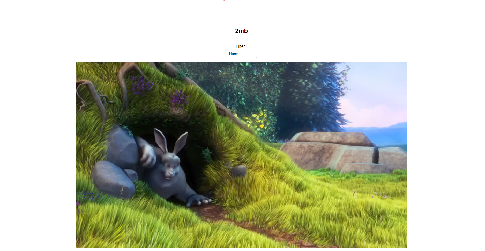

# Video Annotation Tool

A Simple, Elegant UI to annotate videos with labels


## Structure

The Directory Structure looks as follows

```
.
├── backend
├── frontend
└── README.md
```

## Setup

### Backend Setup 

```
cd backend
python -m venv .venv
source .venv/bin/activate
pip install -r requirements.txt
python manage.py migrate`
python manage.py runserver
```

### Frontend Setup

```
cd frontend
npm install
npm start
```

### Screenshots



